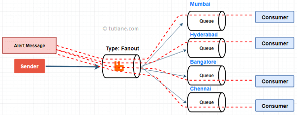
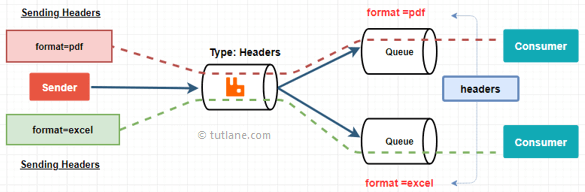
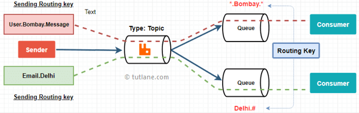
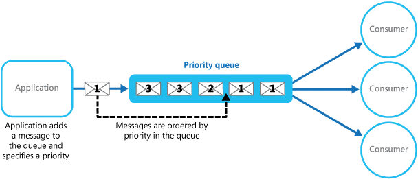
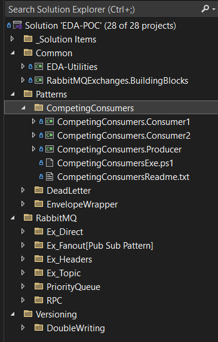

# Event-Driven Architecture Proof-of-Concepts

This repository showcases various **Event-Driven Architecture (EDA)** Proof-of-Concepts (POCs) using **RabbitMQ**, **C#**, and **MassTransit**. It demonstrates key messaging patterns, RabbitMQ exchange types, and advanced concepts in distributed systems.

---

## Features

### **Implemented Patterns**
- **Competing Consumers**  
  Efficiently distribute workload across multiple consumers to enhance scalability.
- **Dead Letter**  
  Gracefully handle message failures by routing unprocessed messages to a designated queue for further inspection.
- **Envelope Wrapper**  
  Add metadata to messages to provide context and flexibility in processing.

### **RabbitMQ**
  #### **Exchanges**
- **Direct**  
  Route messages to specific queues based on exact routing keys.
  
- **Fanout**  
  Broadcast messages to all queues bound to the exchange.
  
- **Headers**  
  Route messages based on header attributes, offering flexible filtering.
  
- **Topic**  
  Use wildcard patterns to achieve flexible routing for complex scenarios.
  
  #### **Patterns**
- **Priority Queue**  
  Prioritize message delivery based on predefined priority levels.
    
- **RPC (Remote Procedure Call)**  
  Implement synchronous communication over RabbitMQ for request-response workflows.
    
### **Versioning**
- **Double Writing**  
  Support message versioning and schema evolution by maintaining backward compatibility during system upgrades.

---

## Technologies Used
- **RabbitMQ**: A robust message broker for implementing asynchronous messaging and distributed systems.
- **MassTransit**: A library that simplifies message-based communication with RabbitMQ and other brokers.
- **C#**

---


## How to Run

### **Clone this repository**
```bash
   git clone https://github.com/yourusername/Event-Driven-Architecture-POCs.git
```
### **RabbitMQ Installation**
To run the project, you need to have RabbitMQ installed. You can install RabbitMQ manually or use Docker for a faster setup.

#### **Using Docker**
Run the following script to quickly set up RabbitMQ with the management plugin:
```bash
docker run -d \
  --hostname my-rabbit \
  --name rabbitmq \
  -p 5672:5672 \
  -p 15672:15672 \
  rabbitmq:management
```
### **Using PowerShell Scripts**
This repository includes PowerShell scripts to simplify running the projects.  

---

## Project Structure
The following diagram provides an overview of the project structure:



---